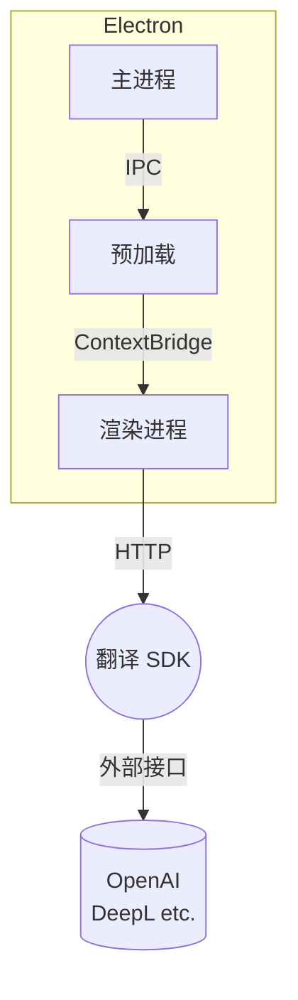

# AutoI18n for Next.js – 桌面版

[](./LICENSE)
[](https://github.com/kamjin3086/AutoI18n-For-NextJs-Desktop/actions)

AutoI18n Desktop 是一款跨平台的 **Electron + Vue 3 + Vite** 应用，旨在帮助开发者为 **Next.js** 项目实现一键国际化。

> 本 README 为中文版，英文版请查看 [README_EN.md](./README_EN.md)。

---

## 目录

- [特性亮点](#特性亮点)
- [界面预览](#界面预览)
- [目录结构](#目录结构)
- [环境要求](#环境要求)
- [快速开始](#快速开始)
- [进阶使用](#进阶使用)
- [常用脚本速查](#常用脚本速查)
- [架构概览](#架构概览)
- [FAQ](#faq)
- [贡献指南](#贡献指南)
- [社区与支持](#社区与支持)
- [License](#license)

---

## 特性亮点

- 🚀 **自动识别目录**：兼容 `app/` 与 `pages/` 两种 Next.js 结构
- 🔍 **智能文案提取**：支持扫描 TS/JS/JSX/TSX 及 Markdown，输出可维护的 JSON 语料
- 🈳 **多翻译源接入**：内置 OpenAI / DeepL / 本地 HTTP 等多种引擎，支持代理
- 🛡 **品牌词保护**：自定义保留词，确保品牌名称、专有名词不被误译
- ✨ **增量更新**：基于 diff 仅生成缺失字段，保持已有翻译不变
- ⚡️ **静态渲染&路由**：可选启用 SSG 与多语言重定向，提升 SEO
- 💻 **跨平台**：一套代码同时支持 Windows、macOS、Linux

---

## 界面预览


---

## 目录结构

```text
packages/
  main/        # Electron 主进程
  preload/     # 预加载脚本，桥接 Node ⇄ 渲染进程
  renderer/    # Vue 3 渲染层 + TailwindCSS
  tests/       # Vitest 单元测试
buildResources/   # 应用图标、安装器配置
scripts/          # 辅助脚本
release-notes_*.md  # 更新日志（中英）
```

---

## 环境要求

|              | 版本 |
|--------------|------|
| Node.js      | ≥ 18（推荐 LTS） |
| 包管理器      | npm / yarn / pnpm |
| 操作系统      | Windows、macOS、Linux |

---

## 快速开始

```bash
# 1. 克隆项目
$ git clone https://github.com/kamjin3086/AutoI18n-For-NextJs-Desktop.git
$ cd AutoI18n-For-NextJs-Desktop

# 2. 安装依赖
$ npm install

# 3. 启动开发模式（HMR）
$ npm run watch

#   ✓ 渲染进程基于 Vite 实时热更新
#   ✓ 主进程 / 预加载脚本改动自动重启 Electron

# 4. 运行单元测试
$ npm test
```

[下载](https://auto-i18n-websites.vercel.app/download)

---

## 进阶使用

1. **生成国际化文件**：在 UI 中选择 Next.js 项目根目录，即可一键扫描并生成多语言 JSON。
2. **命令行集成**：桌面应用底层复用了 AutoI18n CLI，亦可通过 `nodeapp.ts` 暴露的 API 在脚本中调用。
3. **自定义翻译服务**：编辑 `.env`，填入自有翻译后端的 URL 与凭据。
4. **更新 Next-Intl**：勾选「重新集成 next-intl」可自动注入 Provider 与 Hook 代码。

更多用法请参考应用内帮助或官网文档。

---

## 常用脚本速查

| 脚本 | 功能 |
|------|------|
| `watch` | 开发模式（含热更新） |
| `build` | 打包 `renderer / preload / main` |
| `compile` | 构建可执行目录（无安装器） |
| `dist` | 生成安装包（NSIS / DMG / deb） |
| `test` | Vitest 单元测试 + e2e |
| `lint` | ESLint 代码规范检查 |
| `typecheck` | TypeScript / Vue 类型检查 |
| `format` | Prettier 一键格式化 |

---

## 架构概览



---

## FAQ

<details>
<summary>启动后窗口空白怎么办？</summary>
请检查 Node.js 版本 ≥ 18，且未被公司代理拦截。可尝试 `npm run watch` 查看日志。
</details>

<details>
<summary>生成的 JSON 与现有翻译冲突？</summary>
程序默认进行"增量合并"。如仍被覆盖，请确认 key 无重复或关闭"覆盖已有字段"选项。
</details>

---

## 贡献指南

欢迎 PR！请遵循以下流程：

1. Fork & 拉取最新 `main`
2. 创建功能分支 `git checkout -b feat/your-feature`
3. 开发前运行 `npm run lint && npm run typecheck`
4. 提交前运行 `npm test`
5. 创建 Pull Request 并描述变更

如需讨论，请提交 Issue 或加入 Discord 交流群。

---

## 社区与支持

- Issues: <https://github.com/kamjin3086/AutoI18n-For-NextJs-Desktop/issues>
- 邮箱:  kamjindev@gmail.com
- 网站: https://auto-i18n-websites.vercel.app
---

## License

Released under the [MIT](./LICENSE) license.
