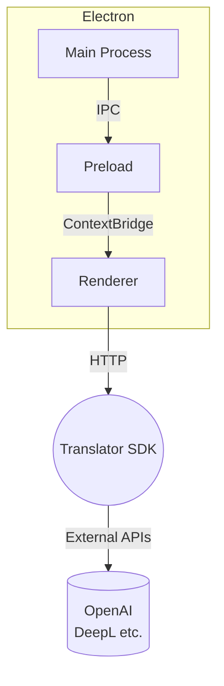

# AutoI18n for Next.js – Desktop Edition

[](./LICENSE)
[](https://github.com/kamjin3086/AutoI18n-For-NextJs-Desktop/actions)

AutoI18n Desktop is a cross-platform application built with **Electron + Vue 3 + Vite** that helps developers internationalize their **Next.js** projects in just one click.

> This document is the English counterpart of the Chinese README.

---

## Table of Contents

- [Key Features](#key-features)
- [Screenshots](#screenshots)
- [Project Structure](#project-structure)
- [Requirements](#requirements)
- [Quick Start](#quick-start)
- [Advanced Usage](#advanced-usage)
- [Scripts Cheat Sheet](#scripts-cheat-sheet)
- [Architecture](#architecture)
- [FAQ](#faq)
- [Contributing](#contributing)
- [Community & Support](#community--support)
- [License](#license)

---

## Key Features

- 🚀 **Auto Directory Detection** – Works with both `app/` and `pages/` layouts.
- 🔍 **Intelligent Text Extraction** – Scans TS/JS/JSX/TSX/MD files and generates maintainable JSON catalogs.
- 🈳 **Multiple Translation Engines** – Built-in support for OpenAI, DeepL, or your own HTTP service (proxy ready).
- 🛡 **Brand Word Protection** – Keeps brand names and proper nouns untouched during translation.
- ✨ **Incremental Updates** – Only missing keys are added; existing translations remain intact.
- ⚡️ **Static Rendering & Routing** – Optional SSG and i18n redirects for better SEO.
- 💻 **Cross-Platform** – Run seamlessly on Windows, macOS, and Linux.

---

## Screenshots


---

## Project Structure

```text
packages/
  main/        # Electron main process
  preload/     # Preload scripts (context bridge)
  renderer/    # Vue 3 renderer with TailwindCSS
  tests/       # Vitest unit tests
buildResources/   # Icons & installer assets
scripts/          # Helper scripts
release-notes_*.md  # Changelogs (EN & CN)
```

---

## Requirements

|            | Version |
|------------|---------|
| Node.js    | ≥ 18 (LTS recommended) |
| Package mgr| npm / yarn / pnpm |
| OS         | Windows, macOS, or Linux |

---

## Quick Start

```bash
# 1. Clone the repository
$ git clone https://github.com/kamjin3086/AutoI18n-For-NextJs-Desktop.git
$ cd AutoI18n-For-NextJs-Desktop

# 2. Install dependencies
$ npm install

# 3. Launch dev mode with hot reload
$ npm run watch

#   ✓ Vite HMR for renderer
#   ✓ Electron auto-reload for main/preload

# 4. Run unit tests
$ npm test
```

---

## Advanced Usage

1. **Generate Locale Files** – Pick a Next.js root in the UI and click *Scan* to auto-generate JSON files for each language.
2. **CLI Integration** – The desktop app re-uses the AutoI18n CLI core; you can call it via `nodeapp.ts` in your own scripts.
3. **Custom Translation Backend** – Provide your server's URL and credentials via `.env`.
4. **Re-integrate Next-Intl** – Enable the *Re-integration* toggle to auto-inject Provider and Hooks.

For more details, see the in-app help or official docs.

---

## Scripts Cheat Sheet

| Script       | Description |
|--------------|-------------|
| `watch`      | Dev mode with hot reload |
| `build`      | Bundle renderer / preload / main |
| `compile`    | Build to executable directory (no installer) |
| `dist`       | Create installers (NSIS / DMG / deb) |
| `test`       | Run Vitest unit & e2e tests |
| `lint`       | ESLint code linting |
| `typecheck`  | TypeScript & Vue TS type check |
| `format`     | Prettier formatting |

---

## Architecture



---

## FAQ

<details>
<summary>The window is blank after start-up</summary>
Ensure you have Node.js ≥ 18 and no company proxy blocks electron. Run `npm run watch` and check the console for errors.
</details>

<details>
<summary>Existing translations are overwritten</summary>
The app performs *incremental merge* by default. Confirm no duplicate keys or disable the *overwrite* option.
</details>

---

## Contributing

PRs are welcome! Please follow the steps:

1. Fork & pull the latest `main`.
2. Create a feature branch `git checkout -b feat/your-feature`.
3. Run `npm run lint && npm run typecheck` before coding.
4. Ensure `npm test` passes before pushing.
5. Open a Pull Request with a clear description.

Discuss issues or ideas via GitHub Issues or join our Discord.

---

## Community & Support

- Issues: <https://github.com/kamjin3086/AutoI18n-For-NextJs-Desktop/issues>
- Email:  kamjindev@gmail.com

---

## License

Released under the [MIT](./LICENSE) license. 